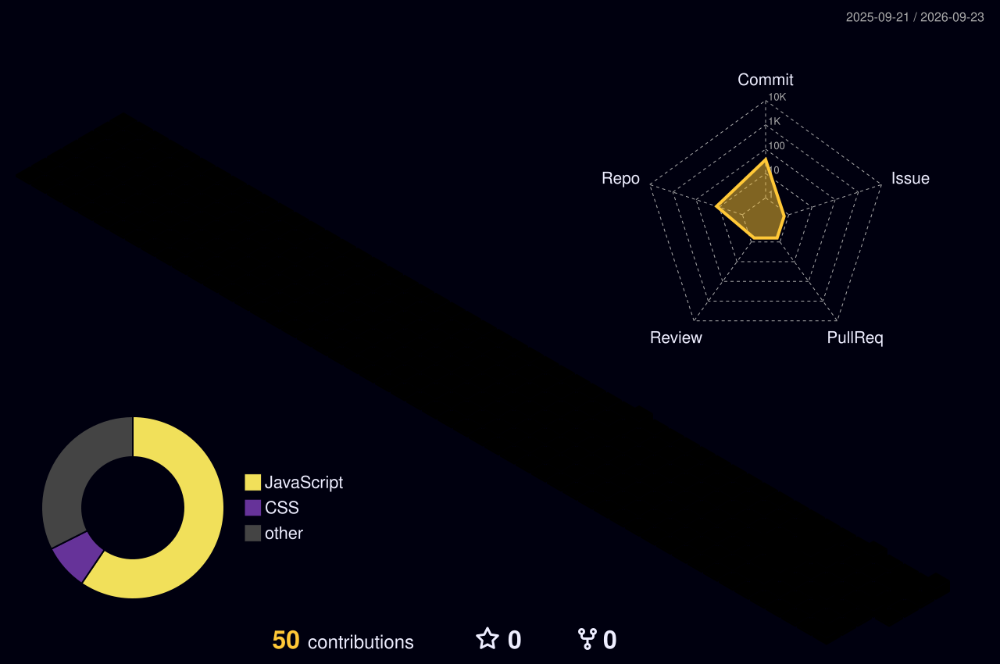

<!-- ==================== PROFILE BANNER ==================== -->

  

<!-- ==================== ANIMATED INTRODUCTION ==================== -->

  

<!-- ==================== CONTACT BUTTONS ==================== -->

  

  

  

  
  

---

## 👩‍💻 Professional Profile

I am a **final-year BSc (Hons) Information Technology undergraduate** at the **University of Vavuniya, Sri Lanka**.

I am an aspiring IT professional with practical experience in designing and developing responsive web applications, REST APIs, database-driven systems and AI-integrated applications. I enjoy learning new technologies and using them to solve real-world problems.

- 🎓 Final-year BSc (Hons) Information Technology undergraduate
- 💻 Developing full-stack and responsive web applications
- 🤖 Building applications with AI API integrations
- 🗄️ Working with relational and NoSQL databases
- 🧪 Interested in Software Testing and Quality Assurance
- 🛠️ Open to IT Support and other technical roles
- 📊 Interested in Systems and Business Analysis
- 🌱 Continuously improving my technical and professional skills
- 🎯 Currently seeking a student-friendly IT internship opportunity

---

## 🎯 Career Interests

  
  
  
  

  
  
  
  

---

## 🛠️ Technical Skills

### Programming Languages

  
  
  
  
  
  

### Frontend Development

  
  
  
  
  

### Backend Development

  
  
  
  
  

### Databases

  
  
  

### Tools and Platforms

  
  
  
  
  
  
  
  
  

### Additional Knowledge

  Object-Oriented Programming • Responsive Web Design • Local Storage
   
  Git Version Control • API Integration • Authentication
   
  MPI Parallel Computing • JADE Agent Programming • AI Application Development

---

## 🚀 Featured Projects

### 🌲 ForestGuard — AI Forest Management System

AI-powered forest monitoring platform with forest-area, officer, inspection and AI image-analysis features.

**Technologies:** React.js • Node.js • Express.js • MongoDB • Gemini AI

---

### 👗 Enchanted Atelier — AI Fashion Application

Personalized fashion-design application that generates dress concepts according to user-selected preferences.

**Technologies:** React.js • Node.js • Express.js • MongoDB • Gemini AI

---

### 🏗️ Smart Construction Project Manager

Construction-management platform with projects, tasks, materials, expenses, workers and AI-powered project analysis.

**Technologies:** React.js • Tailwind CSS • Local Storage

---

### 🏥 Healthcare Appointment System

Healthcare application with doctor search, appointment booking, appointment tracking, authentication and user-profile features.

**Technologies:** React.js • React Router • Local Storage

---

### 💼 Career Guidance and Internship Hub

Career-development platform designed to help university students discover internship and employment opportunities.

**Technologies:** React.js • Node.js • MySQL • JWT • Firebase

---

### 🌐 Personal Portfolio

Responsive portfolio showcasing my education, technical skills, projects and contact information.

**Technologies:** React.js • CSS • Responsive Design

  

---

## 📊 GitHub Analytics

  
  

  

---

## 📈 Contribution Activity Graph

  

---

## 🌌 3D Contribution Activity

  

---

## 🐍 Animated Contribution Snake

  <picture>
    <source
      media="(prefers-color-scheme: dark)"
      srcset="https://raw.githubusercontent.com/KeshanyaRamesh/KeshanyaRamesh/output/github-contribution-grid-snake-dark.svg"
    />
    <source
      media="(prefers-color-scheme: light)"
      srcset="https://raw.githubusercontent.com/KeshanyaRamesh/KeshanyaRamesh/output/github-contribution-grid-snake.svg"
    />
    
  </picture>

---

## 🤝 Let's Connect

  I am open to IT internships, collaborations and opportunities to learn from industry professionals.

  

  

  

---

  <strong>💙 Thank you for visiting my GitHub profile!</strong>

  <em>Learning continuously • Building practically • Growing professionally</em>

